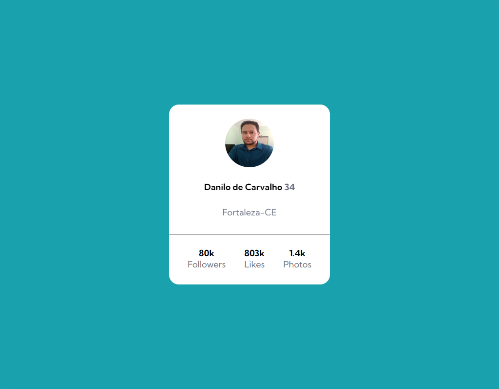
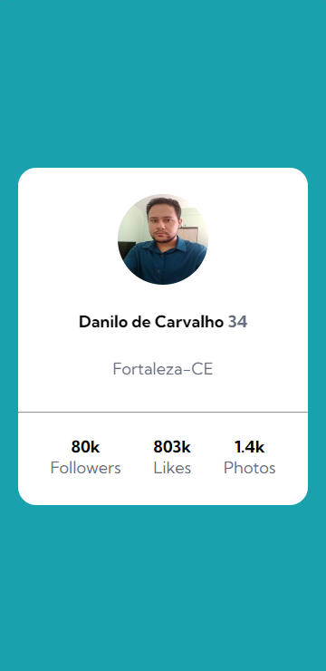

<h1 align="center">
    <p>Card de Perfil</p>
</h1>

<h2>Versão para desktop 🖥</h2>


<h2>Versão para mobile 📱</h2>


<h3 align="center">
    <a href="#">Link da página</a>
</h3>

---

# 📑 Índice
- [Sobre](#-sobre)
- [Tecnologias utilizadas](#-tecnologias-utilizadas)
- [Como baixar o projeto](#-como-baixar-o-projeto)

---

## 📖 Sobre
O projeto "Card de Perfil" foi criado para prática das funcionalidades de responsividade do CSS utilizando Flexbox.

---

## 💻 Tecnologias utilizadas
- HTML
- CSS

---

## 💽 Como baixar o projeto

1 - Clonar o repositório.

```bash
    $ git clone 
```

2 - Entrar no diretório.

```bash
    $ cd menu-bank 
```

3 - Instalar as dependências.

```bash
    $ yarn install 
```

4 - Iniciar o projeto.

```bash
    $ yarn start
```

Desenvolvido por Danilo de Carvalho 😎
